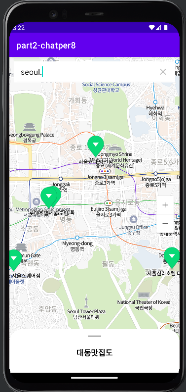
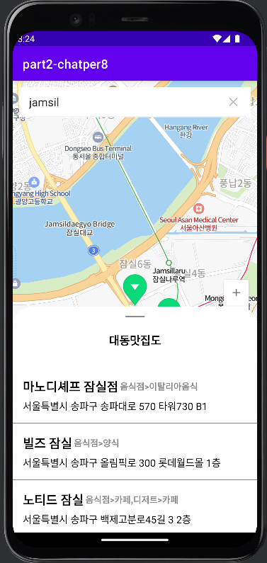

# 대동맛집도 (part2-chapter8)

## 이 챕터를 통해 배우는 것

1. NaverMap
2. Naver Open API
3. BottomSheetBehavior
4. Moshi

## NaverMap

[https://navermaps.github.io/android-map-sdk/guide-ko/1.html](https://navermaps.github.io/android-map-sdk/guide-ko/)

네이버 지도 SDK는 네이버 지도 앱을 비롯한 네이버의 여러 서비스에서 사용 중인 지도 엔진입니다. 대규모 사용자가 이용하는 서비스에 다년간 적용되어 기능과 안정성이 보장됩니다. 또한 개발자 친화적인 API를 제공하므로 SDK가 제공하는 강력한 기능을 쉽게 사용할 수 있습니다.

네이버 지도 SDK는 네이버 지도같은 복잡한 서비스에서 요구되는 다양한 기능을 모두 수용하는 강력한 기능을 제공합니다.

[출처 : 네이버 지도 SDK 소개]

## Naver Open API

[https://developers.naver.com/docs/common/openapiguide/](https://developers.naver.com/docs/common/openapiguide/)

네이버 플랫폼의 정보를 외부 개발자가 쉽게 이용할 수 있도록 제공하는 API

### 검색 API (지역)

[검색 > 지역 - Search API](https://developers.naver.com/docs/serviceapi/search/local/local.md#%EC%A7%80%EC%97%AD)

## Bottom Sheet Behavior

[Material Design](https://m2.material.io/develop/android/components/bottom-sheet-dialog-fragment)

CoordinatorLayout

- FrameLayout 기반의 강력한 상호작용 레이아웃
- 자식 Behavior 들과의 이동 및 애니메이션 작용 등을 다룰 때 사용할 수 있음.
    - AppBarLayout 의 스크롤 시 크기 변경
    - 하단 FloatingButton 의 스크롤 시 위치 변경 등

## Moshi

[https://github.com/google/gson](https://github.com/google/gson)

[https://github.com/square/moshi](https://github.com/square/moshi)

Moshi is a modern JSON library for Android, Java and Kotlin. It makes it easy to parse JSON into Java and Kotlin classes

Gson 

- Java 로 구현되어 있음
- Star : 21.8k
- until 2008

Moshi 

- Kotlin 으로 구현되어 있음
- Star : 8.7k
- until 2015